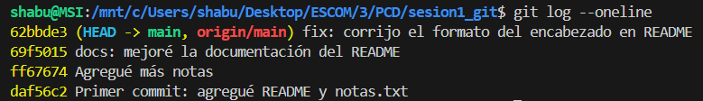

# Documentación - Sesión 1: Git y Control de Versiones

## Pasos que realicé

### 1. Verificación e instalación de Git
Primero verifiqué si tenía Git instalado en mi sistema:
```bash
git --version
```

### 2. Configuración inicial
Configuré mi información personal en Git:
```bash
git config --global user.name "ADavid97"
git config --global user.email "tu-email@ejemplo.com"
git config --list
```

### 3. Creación del repositorio local
Creé una carpeta para mi proyecto e inicialicé un repositorio Git:
```bash
mkdir sesion1_git
cd sesion1_git
git init
git status
```

### 4. Creación de archivos iniciales
Creé el archivo `notas.txt` con 3 líneas como solicitaba la tarea:
```bash
echo "Primera línea de mis notas" > notas.txt
echo "Segunda línea con más información" >> notas.txt
echo "Tercera línea para completar" >> notas.txt
echo "# Mi primer repositorio de Git" > README.md
ls -la
git status
```

### 5. Mi primer commit
Agregué los archivos al área de staging e hice mi primer commit:
```bash
git add notas.txt
git add README.md
git commit -m "Primer commit: agregué README y notas.txt"
git log --oneline
```

### 6. Edición y segundo commit
Agregué 2 líneas más al archivo `notas.txt` como pedía la tarea:
```bash
echo "Cuarta línea - aprendiendo Git" >> notas.txt
echo "Quinta línea - esto es genial" >> notas.txt
git diff
git add notas.txt
git commit -m "Agregué más notas"
```

### 7. Mejora del README y tercer commit
Mejoré la documentación del README agregando más secciones:
```bash
echo "" >> README.md
echo "## Descripción" >> README.md
echo "Este es mi primer repositorio aprendiendo Git y control de versiones." >> README.md
echo "" >> README.md
echo "## Archivos incluidos" >> README.md
echo "- README.md: Documentación del proyecto" >> README.md
echo "- notas.txt: Mis notas de aprendizaje" >> README.md
git add README.md
git commit -m "docs: mejoré la documentación del README"
```

### 8. Conexión con GitHub
Creé un repositorio en GitHub y conecté mi repositorio local:
```bash
git remote add origin https://github.com/ADavid97/sesion1_git.git
git remote -v
git branch -M main
git push -u origin main
```

### 9. Corrección del formato
Corregí un pequeño error de formato en el README:
```bash
# Edité README.md para corregir ##Descripción por ## Descripción
git add README.md
git commit -m "fix: corrijo formato del encabezado en README"
git push
```

## Historial de commits


## Lo que aprendí
- Cómo inicializar un repositorio Git local
- El flujo básico: Working Directory → Staging Area → Repository
- Cómo hacer commits con mensajes descriptivos
- Cómo conectar un repositorio local con GitHub
- La importancia del control de versiones

## Archivos que creé
- `README.md`: Documentación principal del proyecto
- `notas.txt`: Archivo con mis notas de aprendizaje
- `PROCESO.md`: Este archivo documentando mi proceso
